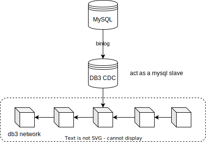

# DB3 CDC

The first decentralized live backup tool for mysql which has the following features

* [x] replicate mysql to db3 in realtime
* [x] recover from last synchronization progress which is stored in db3 after restarting db3cdc
* [ ] recover mysql from db3

`Warning`: Using DB3 and DB3 CDC in production enviroment is not recomended

# How it works



when starting db3cdc for the first time, it will sync data from the begining of mysql binlog and submit mutation including the binlog events and the progress of synchronization. if you restart db3cdc, it will sync data from the last position that has been submited to db3 

# Getting Started

1. Download the release of db3 cdc from [github](https://github.com/dbpunk-labs/db3cdc/releases/tag/v0.2.0) according to your operation system, if you want run db3 cdc in linux 

```shell
wget https://github.com/dbpunk-labs/db3cdc/releases/download/v0.1.0/db3cdc-v0.2.0-linux-x86_64.tar.gz
tar -zxf db3cdc-v0.2.0-linux-x86_64.tar.gz
cd ./db3cdc-v0.2.0-linux-x86_64/
./bin/db3cdc --help
Usage: db3cdc <COMMAND>

Commands:
  sync     Start a interactive shell
  version  Get the version of DB3 CDC
  help     Print this message or the help of the given subcommand(s)

Options:
  -h, --help  Print help information
```
2. use db3cdc to replicate mysql to db3

```
./bin/db3cdc sync --db3-node-grpc-url https://grpc.devnet.db3.network\
 --password mysql_password \
 --user mysql_root_user \
 --master-host mysql_host \
 --master-port mysql_port
```
the devnet is unstable, you can change the grpc url to the following nodes in our testnet
* ap-southeast node, grpc http://18.142.114.145:26659
* ap-east node, grpc http://18.162.230.6:26659 
* us-east node, grpc http://18.117.125.43:26659
* eu-west node, grpc http://13.41.65.17:26659 

3. You will see some information

```
2022-11-21T04:47:29.038953Z  INFO db3cdc: no gtid state in db3
WARNING, db3 will generate private key and save it to /home/jackwang/.db3/user.key
restore the key with addr 0x97b478ac2bef8762c2ecc08417f35838c4bf73fc
2022-11-21T04:47:29.040835Z  INFO db3cdc: binlog options BinlogOptions { filename: "", position: 4, gtid_set: None, gtid_list: None, starting_strategy: FromStart }
2022-11-21T04:47:29.349037Z  INFO db3cdc: mutation id "tWYRruF8dSwvOySMypYCD0pJTVZgquKZu116UddTAps="
2022-11-21T04:47:29.429778Z  INFO db3cdc: Your account 0x97b478ac2bef8762c2ecc08417f35838c4bf73fc status: total bills 0.000000 db3, total storage used 0.00 , total mutation 0, credits 10 db3
```

these information includes
* your key path
* last synchronization progress
* your account bills status and credit


